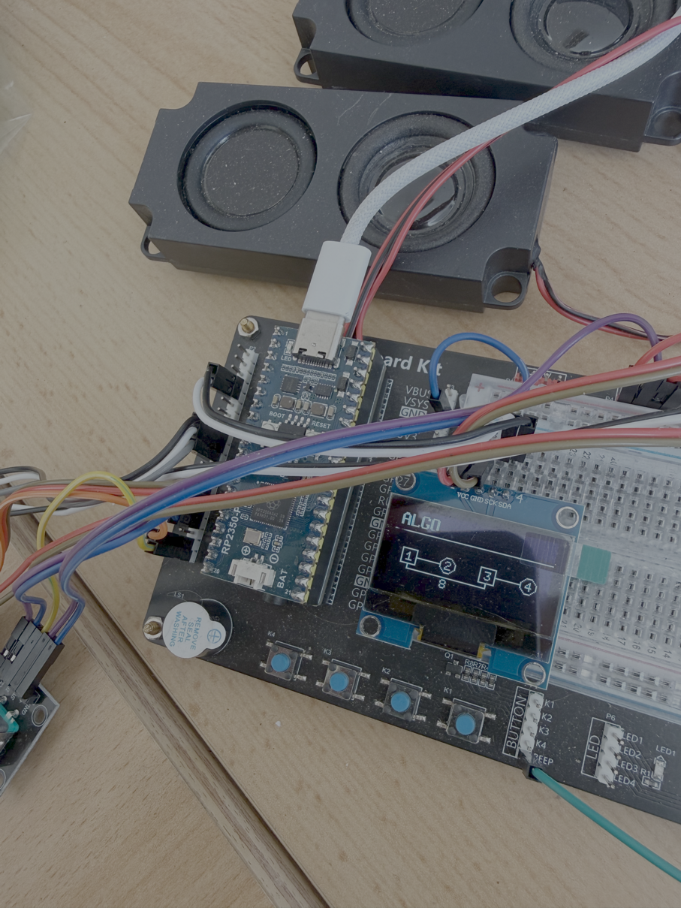

# PicoFaceDX

<p align="center">
  
</p>

A Yamaha reface DX FM-synth clone for the RP2350. PicoFaceDX is the sibling project of PicoFaceCP, sharing the same hardware base (SparkFun Pro Micro RP2350 board, I2S DAC output, SH1106 128×64 OLED, 3 rotary encoders) but replacing the CP's sample-based piano engine entirely with a 4-operator, 12-algorithm FM synthesis engine.

## Features

| Area | Details |
|---|---|
| Engine | 4-operator, 12-algorithm FM synthesis (ported from ESP32/Arduino reference) |
| Polyphony | 8 voices (`MAX_VOICES=8`) |
| Sample rate | 44100 Hz |
| DMA buffer | 64 samples (`DMA_BUFFER_LEN=64`) |
| DSP style | Header-only, no dynamic allocation, fixed buffers, single-precision float throughout audio path |
| MIDI | USB-MIDI only (TinyUSB, no DIN port) — full reface DX MIDI/SysEx |
| Effects | 2 slots, 8 types each (Thru/Distortion/Touch Wah/Chorus/Flanger/Phaser/Delay/Reverb), post-mix |
| Persistence | Virtual EEPROM (wear-leveled flash append-log), autosave 2 s after last change |
| Presets | 32 built-in factory presets (real reface DX bank, Program Change 0–31) |
| Display | SH1106 128×64 OLED |
| Controls | 3 rotary encoders (Selector / Param A / Param B) |

## Signal flow / architecture

```
USB-MIDI (Core 1)
    │
    ▼
DX_Controller (Core 1) ──► DX_GUI ──► SH1106 OLED
    │                          ▲
    │ lock-free 32-bit FIFO    │
    ▼ (ipc.h)                  │
DX_Synth_Bridge (Core 0) ──────┘
    │
    ▼
dx_engine (RDX_Synth / RDX_Voice / RDX_Operator / RDX_Envelope / RDX_LFO / RDX_VoiceAlloc)
    │
    ▼
I2S DAC (DMA IRQ)
```

**Core 0** — Audio: I2S DMA IRQ drains the SIO FIFO, then renders one block via `DX_Synth_Bridge::fill_buffer()`.

**Core 1** — USB-MIDI + UI + settings autosave.

Cross-core communication uses a lock-free 32-bit-word FIFO protocol (`include/ipc.h`): note on/off, raw MIDI CC/pitch-bend forwarding, single patch-byte writes (`IPC_CMD_DX_RAW_WRITE`, for SysEx param edits), and a cross-core patch-staging mechanism (`include/dx_patch_stage.h`) for whole-patch transfers (presets, SysEx bulk dump) too large for a single FIFO word.

Audio-rate/mutating methods on `DX_Synth_Bridge` (`init()`, `fill_buffer()`, `noteOn()`, `noteOff()`, `processCC()`, `updatePB()`, `patch()`) run on Core 0 (audio DMA IRQ) only.

## Hardware pinout

Unchanged from the CP-era board — same physical prototype hardware. Defined in `include/project_config.h`.

| Function | Pin |
|---|---|
| I2S DATA | 26 |
| I2S BCLK | 27 |
| I2S LRCLK | 28 |
| OLED SDA | 2 |
| OLED SCL | 3 |
| Selector encoder CLK | 6 |
| Selector encoder DT | 7 |
| Selector encoder SW | 8 |
| Param A encoder CLK | 10 |
| Param A encoder DT | 11 |
| Param A encoder SW | 14 (optional) |
| Param B encoder CLK | 12 |
| Param B encoder DT | 13 |
| Param B encoder SW | 15 (optional) |
| Status LED | 25 |
| DIN-MIDI RX | 5 (present in header, currently unused — USB-MIDI only) |

## Repository layout

```
effects/
  ram_hot.h                      # RAM_HOT() macro — places hot audio functions in RAM on RP2350,
                                 # no-op on host builds. Used pervasively throughout dx_engine/.

include/
  dx_engine/                     # FM synthesis engine (ported from ESP32 reference)
    RDX_Synth.h
    RDX_Voice.h
    RDX_Operator.h
    RDX_Envelope.h               # RDX_Envelope / RDX_PEG
    RDX_LFO.h
    RDX_VoiceAlloc.h
    RDX_Types.h
    RDX_State.h
    RDX_Constants.h
    misc.h
    dx_engine_config.h
    DX_FXHost.h                  # 2-slot effect router
    fx_base.h                    # FXBase interface + FxThru
    fx_distortion.h
    fx_touch_wah.h
    fx_chorus.h
    fx_flanger.h
    fx_phaser.h
    fx_delay.h
    fx_reverb.h
  DX_Controller.h
  DX_GUI.h
  DX_Synth_Bridge.h
  dx_patch_stage.h
  ipc.h
  midi_reface.h
  midi_input_usb.h
  pico_frontpanel.h
  pico_userinterface.h
  pico_hw.h
  presets.h
  settings.h
  project_config.h               # board pin config
  tusb_config.h
  get_serial.h

src/
  main.cpp
  DX_Controller.cpp
  DX_GUI.cpp
  DX_Synth_Bridge.cpp
  midi_reface.cpp
  midi_input_usb.cpp
  pico_frontpanel.cpp
  pico_hw.cpp
  pico_selection_list.cpp
  pico_input_value.cpp
  presets.cpp
  settings.cpp
  veeprom.cpp
  usb_descriptors.c
  get_serial.c

test/
  veeprom_test.cpp               # pure virtual-EEPROM unit tests (storage mechanism only)
  build_veeprom.sh

doc/
  MIDI_IMPLEMENTATION.md
  PERSISTENCE.md
  PRESETS.md
  CHANGELOG_DX_ENGINE.md         # detailed history of the DX port
  CHANGELOG_MIDI_RP2350.md       # archived/superseded, historical reface-CP-era MIDI changelog
  reface owner's manual PDFs

tools/refacedx/
  RDX-Reface-DX-emu/              # original ESP32/Arduino reference project (read-only, not compiled)
  syx_to_patches.cpp               # one-time host tool: .syx factory dumps -> dxPresets[] C++ source
```

> **Host demo gap:** There is currently no host-buildable audio demo for the DX engine. The old macOS CoreAudio + PortMidi demo was CP-specific and was removed with the CP engine. A DX-equivalent host demo does not exist yet and is not part of this pass.

## Building the firmware

**Toolchain:** `arm-none-eabi-gcc`, CMake ≥ 3.22, Ninja.

**Clone with submodules:**

```bash
git clone --recurse-submodules https://github.com/<owner>/PicoFaceDX.git
cd PicoFaceDX
# Ensure pico-sdk and pico-extras submodules are present
```

**Build:**

```bash
mkdir build && cd build
cmake -G Ninja ..
ninja
```

**Firmware footprint:**

| Resource | Usage | Capacity |
|---|---|---|
| Flash | ~164 KB (~0.98%) | 16 MB |
| RAM | ~274 KB (~52.24%) | 512 KB |

Flash dropped from ~26% (when the CP engine's ~8 MB of instrument sample data was present) to under 1%. RAM sits at ~53% mainly due to the effects chain's fixed scratch buffers (2 slots × 96 KB, sized for the largest single effect, `FxReverb`) — budgeted deliberately, not accidental; comfortable headroom remains for stacks and other buffers.

## Controls

The front panel uses 3 rotary encoders. The home screen **is** the DX page view — there is no separate menu entry needed for it.

### Encoder assignments

| Encoder | Function |
|---|---|
| **Selector** | Rotate to page through OP1 → OP2 → OP3 → OP4 → LFO → ALGO → FX1 → FX2 (8 pages). Long-press (≥ 500 ms) opens MENU. Short press is currently a no-op (available for future use, not a bug). |
| **Param A** | Rotate to edit the first value on the current page. |
| **Param B** | Rotate to edit the second value on the current page. |

### Pages

| Page | Param A | Param B |
|---|---|---|
| OP1 | Operator 1 Frequency (coarse) | Operator 1 Output Level |
| OP2 | Operator 2 Frequency (coarse) | Operator 2 Output Level |
| OP3 | Operator 3 Frequency (coarse) | Operator 3 Output Level |
| OP4 | Operator 4 Frequency (coarse) | Operator 4 Output Level |
| LFO | LFO Speed | LFO Pitch Mod Depth (PMD) |
| ALGO | Algorithm (0–11) | Operator 1 Feedback |
| FX1 | Effect Slot 1 Type (0–7) | Effect Slot 1 Param1 |
| FX2 | Effect Slot 2 Type (0–7) | Effect Slot 2 Param1 |

Effect Param2 (e.g. TONE for Distortion, RATE for Chorus/Flanger/Phaser, TIME for Delay/Reverb) is SysEx-only, matching how several other patch parameters (voice name, KSC curves) are already not reachable from the 3-encoder front panel.

Every page shows its two live parameter values on the OLED (not just an "edit via encoders" placeholder) — OP1-4 show Freq/Level, LFO shows Speed/PMD, FX1/FX2 show the effect Type plus a per-type-labeled Param1 (e.g. "Drive" for Distortion, "Sens" for Touch Wah, "Depth" for Chorus/Flanger/Phaser/Reverb, "Feedback" for Delay — Thru has no parameters, so only its Type is shown), and ALGO renders the actual algorithm diagram.

### Menu (Selector long-press ≥ 500 ms)

| Entry | Description |
|---|---|
| **Presets** | Lists all 32 built-in factory presets |
| **System** | About screen, CPU Load screen (live + peak %), MIDI receive channel setting |
| **&lt;&lt;BACK** | Returns to the DX page view |

The page view is drawn by `DX_GUI` (`dxDrawScreen()`), which includes an algorithm-diagram renderer for all 12 FM algorithm topologies, ported byte-for-byte from the ESP32 reference's geometry tables.

## MIDI

USB-MIDI only (TinyUSB, no DIN port). Full reface DX MIDI/SysEx implementation:

- Note On / Note Off
- Pitch Bend (forwarded to `RDX_Synth::updatePB`)
- Control Change: mod wheel, volume, expression, sustain, portamento, algorithm quick-select, operator quick-edit CCs (forwarded to `RDX_Synth::processCC`); the algorithm/operator quick-edit CCs are gated by the SYSTEM "MIDI Control" setting, matching the real hardware
- Program Change 0–31, selecting the corresponding factory preset
- Active Sensing
- Identity Reply
- Parameter Change / Request
- Bulk Dump / Request (addressing System / Common / Operator blocks)
- Master Tune (SYSTEM SysEx parameter, ±102.4/±102.3 cents) applied additively to pitch bend on all operators

Full spec: `doc/MIDI_IMPLEMENTATION.md`.

## Persistence

Virtual EEPROM (wear-leveled flash append-log, unchanged mechanism from the CP-era) persists:

- Octave
- MIDI SYSTEM block
- Full current DX patch

Stored as `SettingsV2` (`include/settings.h`). Autosave occurs 2 s after last change. The virtual EEPROM flash-park IPC handshake for safe multicore flash writes is the same mechanism as before — only the persisted payload struct changed.

Full spec: `doc/PERSISTENCE.md`.

## Presets

All 32 real Yamaha reface DX factory-bank voices (Program Change 0–31, 4 banks of 8), parsed byte-exact from the official `.syx` factory dumps shipped with the ESP32 reference project via a one-time host tool (`tools/refacedx/syx_to_patches.cpp`) and the already-verified `syxToPatch()`. Full parity with the real factory bank.

Full spec: `doc/PRESETS.md`.

## Effects

2 independent effect slots, each selectable among 8 types: Thru, Distortion, Touch Wah, Chorus, Flanger, Phaser, Delay, Reverb — the real reface DX effect set, confirmed against the official Yamaha Data List and ported from the ESP32 reference project's complete implementation (`fx_*.h`). Processing happens post voice-mix in `DX_Synth_Bridge::fill_buffer()`, before the I2S output.

- Patch/SysEx-addressable only (matches the real hardware — no dedicated MIDI CC control exists for effects).
- Front-panel access via the FX1/FX2 pages (Type + Param1); Param2 is SysEx-only.
- RP2350 adaptation: the ESP32 original dynamically probed heap_caps/PSRAM for scratch buffers and throttled polyphony based on measured effect CPU time; this build uses one fixed static scratch buffer per slot instead (96 KB, sized for the largest single effect, `FxReverb`), and no throttling (this project already has a fixed `MAX_VOICES` budget).
- Switching an effect slot's type only clears the scratch region the incoming effect actually needs (`FXBase::scratchFootprintFloats()`), not the full 96 KB buffer — found via a real on-hardware CPU-load measurement showing a 140% peak (buffer underrun) on every effect switch; see `doc/CHANGELOG_DX_ENGINE.md` §19. Switching into Delay or Reverb specifically can still cause one brief (<1 block) audio blip, since their delay lines are inherently close to the worst-case buffer size.

## Design notes

- **Header-only DSP style** continues in `dx_engine/` — no dynamic allocation, fixed buffers.
- **`RAM_HOT()` macro** (`effects/ram_hot.h`) places hot audio functions in RAM on RP2350 to avoid XIP-jitter in the audio IRQ. No-op on host builds. Renamed from the old CP-era `CP_HOT()` / `cp_hot.h` — pure rename, same mechanism. Used pervasively throughout `dx_engine/`.
- **Single-precision float** throughout the audio path, including the effects chain.
- **Virtual EEPROM flash-park IPC handshake** for safe multicore flash writes — same mechanism as before, only the persisted payload struct changed.
- **CPU load instrumentation**: `DX_Synth_Bridge::fill_buffer()` times itself against its real-time budget (`time_us_32()`) and exposes current/peak percentages, readable from the System menu's "CPU Load" screen. This is measurement infrastructure, not a substitute for an actual on-hardware load test with all 8 voices and both effect slots active — that number can only be read by flashing real hardware.
- **FPU flush-to-zero enabled at boot** (`pico_init()`, `src/pico_hw.cpp`): found via a real on-hardware load test showing hissing/jitter during fast note changes — the operator feedback low-pass filter (and other IIR state in the effects chain) decays into the subnormal float range on every voice release, and the Cortex-M33 FPU's software denormal path is far slower than normal, occasionally blowing the audio IRQ's time budget. Set via inline VMRS/VMSR assembly (the SDK's CMSIS core headers aren't reachable from this build's include path); see `doc/CHANGELOG_DX_ENGINE.md` §20.
- **Soft-clip limiter on the final mix** (`softClipSample()`, `src/main.cpp`): velocity-sensitivity can boost an operator's gain to ~1.5x above unity at high output level + velocity (an intentional dynamics feature, present in the ESP32 reference too), and the only safety net was a hard integer clamp, producing audible digital clipping when several factors (level, velocity, algorithm mix, effects) stack up. Replaced with a cheap soft-clipper (transparent below 0.9, smoothly saturating toward ±1.0 above it) that preserves the velocity dynamics without the harsh clipping — a real, independent improvement, though it turned out not to be the cause of the aliasing hiss described below; see `doc/CHANGELOG_DX_ENGINE.md` §21.
- **High-note "hiss" with strong operator feedback is expected FM aliasing, not a bug**: operator feedback (per official spec, sine→sawtooth as feedback increases) generates rich harmonic content; at high pitch, harmonics exceeding Nyquist alias back as audible noise — inherent to non-bandlimited feedback FM, byte-identical to the ESP32 reference. Deliberately not "fixed" in the engine (would mean deviating from the faithful port and audibly changing the character of feedback at high notes); presets that hit it audibly can have operator level/feedback tuned down slightly as a per-patch adjustment. See `doc/CHANGELOG_DX_ENGINE.md` §22.

## Acknowledgements

The FM engine was ported from the open ESP32/Arduino reface DX emulation project (`https://github.com/copych/RDX-Reface-DX-emu.git`) — credit to the RDX ESP32 reface DX emulation project as the FM engine source.

Code for the DX port was developed with an LLM-assisted workflow: architecture and review by the maintainer, code generation via glm-5.2, matching the existing project convention.

## License

GPLv3 — see [LICENSE](LICENSE).
