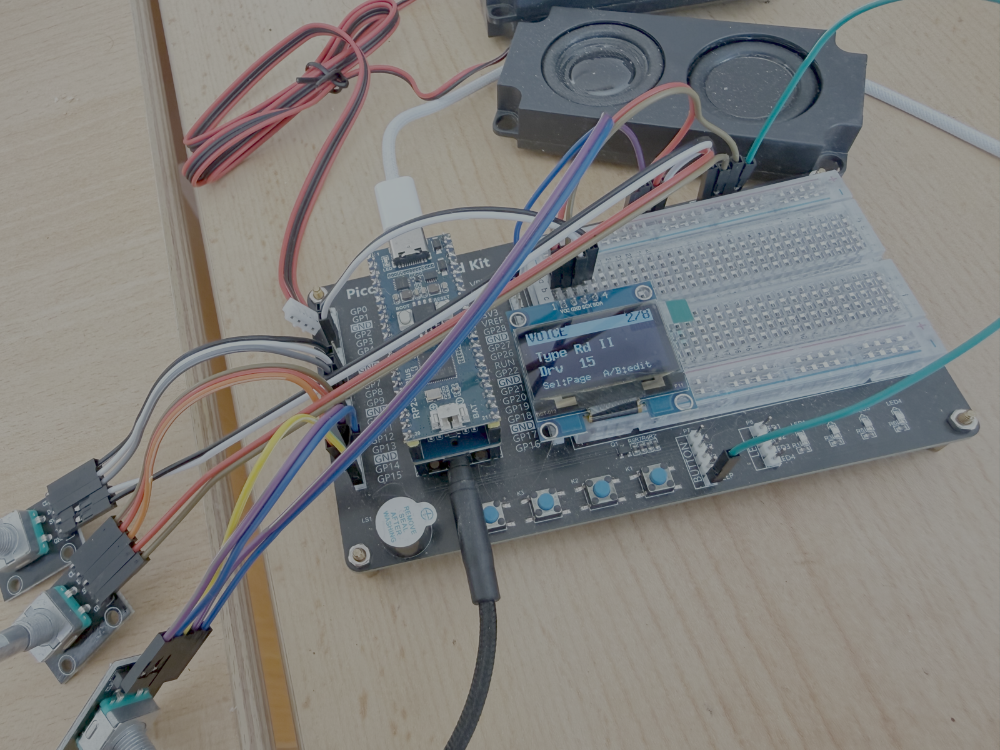

# PicoFaceCP

<p align="center">
  
</p>

**A Yamaha Reface CP emulation for the Raspberry Pi RP2350 (16 MB flash).**

PicoFaceCP turns an RP2350 board into a compact electric-piano module: the
[mda‑EPiano](https://sourceforge.net/projects/mda-vst/) sound engine drives six
classic electric‑piano voices, processed through a faithful re‑creation of the
**Reface CP** insert‑effect chain, and controlled from an SH1106 OLED and
three rotary encoders (Selector, Param A, Param B). A macOS host build lets you
develop and audition the whole signal path on your desktop before flashing
hardware.

---

## Features

- **6 voices** (mda‑EPiano sample engine, 96‑voice polyphony, 44.1 kHz, stereo):
  `Rd I` · `Rd II` · `Wr` · `Clv` · `Piano` · `CP`
- **Reface CP effect chain** — four insert effects in series plus drive & volume,
  with authentic 3‑position switching per block and voice‑type‑linked tremolo.
- **USB‑MIDI, reface CP‑compatible** — Note On/Off, Pitch Bend (±2 semitones),
  the full reface CP Control Change map (Modulation, Volume, Expression,
  Sustain/Sostenuto/Soft Pedal, per‑effect switches & depths, instrument
  select), Channel Mode Messages, Active Sensing, and SysEx (Identity Reply,
  Parameter Change/Request, Bulk Dump/Request). Program Change is *not*
  recognized, matching the original hardware. Full spec:
  [`doc/MIDI_IMPLEMENTATION.md`](doc/MIDI_IMPLEMENTATION.md).
- **Paged front‑panel UI** (SH1106 + three encoders) — the Selector encoder
  pages through eight parameter screens (VOL/OCT · VOICE · TREM/WAH · CHO/PHA ·
  DLY · REVERB · V.PARAMS · SYSTEM); Param A and Param B set the two on‑screen
  values. A short Selector press cycles the effect mode on the TREM/CHO/DLY
  screens; a long press opens the Presets / System menu. Octave (−2..+2)
  transpose lives on the first screen; MIDI receive channel and Pre‑Gain live
  on the last (SYSTEM).
- **Pre‑Gain** — an extra stage ahead of Drive lets you attenuate the signal
  feeding the FX chain, since some effects (Drive, Wah) tend to clip hot
  signals.
- **Header‑only, RP2350‑optimized DSP** — single‑precision float throughout
  (engine and effects), no heap, the per‑sample hot path placed in RAM to
  avoid XIP‑cache jitter inside the audio IRQ.
- **Virtual EEPROM settings persistence** — knobs, instrument, octave, MIDI
  system settings survive power cycles, autosave 2 s after last change; see
  [`doc/PERSISTENCE.md`](doc/PERSISTENCE.md).
- **macOS host demo** (CoreAudio + PortMidi) running the exact same effect code.

Current firmware footprint: **FLASH ≈ 26.3 %** (≈ 4.4 MB / 16 MB), **RAM ≈ 36.4 %**
(≈ 191 KB / 512 KB).

---

## Signal flow

```
              ┌──────────┐   ┌────────┐   ┌──────────────┐   ┌───────────────┐   ┌─────────────────┐   ┌────────┐
MIDI ▶ Voice ▶│ PRE‑GAIN │ ▶ │ DRIVE  │ ▶ │ TREMOLO / WAH│ ▶ │ CHORUS /PHASER│ ▶ │ D.DELAY/A.DELAY │ ▶ │ REVERB │ ▶ VOLUME ▶ I2S out
       engine └──────────┘   └────────┘   └──────────────┘   └───────────────┘   └─────────────────┘   └────────┘
```

| Block | Switch positions | Parameters |
|-------|------------------|------------|
| **Pre‑Gain** | — | level (PicoFaceCP‑only, no reface CC equivalent; avoids FX clipping) |
| **Drive** | — | amount |
| **1 · Tremolo / Wah** | Off / Tremolo / Wah | Depth, Rate |
| **2 · Chorus / Phaser** | Off / Chorus / Phaser | Depth, Speed |
| **3 · D.Delay / A.Delay** | Off / Digital / Analog | Depth, Time |
| **4 · Reverb** | — | Depth |
| **Volume** | — | output level |

The **tremolo** automatically follows the selected voice, exactly like the
hardware: auto‑pan for `Rd I` / `Rd II` / `CP`, amplitude modulation for
`Wr` / `Clv` / `Piano`. The reference for these effects is the official manual
(`doc/ZT92080_reface_En_OM_C0.pdf`, "reface CP" section).

---

## Hardware

Default target board: **SparkFun Pro Micro RP2350** (`PICO_BOARD` in
`CMakeLists.txt`; change it for your own board). Audio output uses an I2S DAC
(e.g. Waveshare Pico‑Audio).

| Function | GPIO | Notes |
|----------|------|-------|
| I2S DATA (DOUT) | 26 | `PICO_AUDIO_I2S_DATA_PIN` |
| I2S BCLK | 27 | `PICO_AUDIO_I2S_CLOCK_PIN_BASE` |
| I2S LRCLK (WS) | 28 | |
| OLED SDA | 2 | SH1106 128×64 over I2C |
| OLED SCL | 3 | |
| Selector encoder CLK | 6 | screen / menu navigation |
| Selector encoder DT | 7 | |
| Selector encoder SW | 8 | short press: cycle effect mode · long press: menu |
| Param A encoder CLK | 10 | sets on‑screen value A |
| Param A encoder DT | 11 | |
| Param A encoder SW | 14 | optional — press resets value A to default |
| Param B encoder CLK | 12 | sets on‑screen value B |
| Param B encoder DT | 13 | |
| Param B encoder SW | 15 | optional — press resets value B to default |
| Status LED | 25 | |
| DIN‑MIDI RX | 5 | optional |

Pins are defined in [`include/project_config.h`](include/project_config.h).

---

## Repository layout

```
effects/              Reface CP effect chain (header-only)
  dsp_fastmath.h        fast tanh/tan approximations
  dsp_lut.h             sine lookup table
  dsp_reverb.h          Schroeder stereo reverb
  reface_cp_fx.h        Tremolo / Chorus / Phaser / Delay primitives
  wahwah.h              standalone MK8 touch-wah
  reface_cp_chain.h     RefaceCpChain master class (setters + getters)
  cp_hot.h              CP_HOT() RAM-placement macro (Pico) / no-op (host)
  cp_audio.h            int16 <-> float block glue
  effect_chain.{h,cpp}  Rhodes MK8 reference chain (source of WahWah)
include/              engine, UI, board and config headers
src/                  main.cpp, mdaEPiano engine, USB-MIDI transport, OLED/encoder UI
  midi_reface.{h,cpp}     reface CP MIDI protocol layer (CC map, SysEx, Active Sensing)
  pico_frontpanel.{h,cpp}  virtual front‑panel UI (home screen + main menu)
test/                 macOS host demo (cp_test.cpp, build_cp.sh)
doc/                  Reface owner's manual + MIDI Data List (PDF)
  MIDI_IMPLEMENTATION.md   PicoFaceCP MIDI spec (reface CP Data List equivalent)
  CHANGELOG_MIDI_RP2350.md MIDI layer + RP2350 float-math changelog
lib/                  pico-sdk, pico-extras, FreeRTOS-Kernel (submodules), u8g2, ...
```

---

## Building the firmware

Requires the Arm GNU toolchain (`arm-none-eabi-gcc`), CMake ≥ 3.22 and Ninja
(or Make).

```bash
# 1. Clone with submodules (pico-sdk, pico-extras, FreeRTOS-Kernel)
git clone --recurse-submodules https://github.com/Michi71/PicoFaceCP.git
cd PicoFaceCP
# (if already cloned: git submodule update --init --recursive)

# 2. Configure & build
cmake -S . -B build -G Ninja
cmake --build build -j4
```

Flash `build/main.uf2` by holding BOOTSEL while plugging in the board and copying
the file to the `RPI-RP2` drive (or use `picotool load build/main.uf2`).

---

## macOS host demo

Build and run the full engine **plus the Reface CP effect chain** natively, with
audio through CoreAudio and MIDI through a virtual PortMidi input named
`mdaepiano`.

```bash
brew install portmidi
./test/build_cp.sh
./test/cp_test
```

Point any DAW / MIDI tool at the `mdaepiano` virtual port to play it.

> The original engine‑only demo (`test/test.cpp`, `./test/build.sh`,
> `test/mdaepiano_test`) is kept alongside it for reference.

---

## Controls

### On the device (OLED + 3 encoders)

The front panel uses **three rotary encoders**: the **Selector** encoder moves
between screens and navigates menus, while **Param A** and **Param B** edit the
two values shown on the current screen. Each value screen looks like:

```
 TREM: Tremolo   3/7   <- header: title (+ current mode) and page number
 ------------
 Depth 25
 Rate  60
 Sel:Mode  A/B:edit    <- hint line
```

- **Turn the Selector** to step through the 8 screens:
  1. **VOL / OCT** — master Volume (A) and Octave −2..+2 (B). Octave is a
     Core‑1 note transpose applied before synthesis.
  2. **VOICE** — Voice Type (A) and Drive (B).
  3. **TREM / WAH** — Depth (A) and Rate (B).
  4. **CHO / PHA** — Depth (A) and Speed (B).
  5. **DLY** — Depth (A) and Time (B).
  6. **REVERB** — Reverb depth (A).
  7. **V.PARAMS** — scroll the mda‑EPiano parameter list with A, edit the
     selected value with B.
  8. **SYSTEM** — MIDI receive channel (A, 1‑16 or *All*) and Pre‑Gain (B,
     0‑100 %, applied ahead of the FX chain).
- **Short press the Selector** on the TREM / CHO / DLY screens to cycle that
  effect's mode (Off → A → B): Off→Tremolo→Wah, Off→Chorus→Phaser,
  Off→Digital→Analog. The header shows the active mode.
- **Long press the Selector** (≥ 0.5 s) opens the main menu: `Presets` ·
  `System` · `<< BACK`.
- **Param A / Param B** set the two on‑screen values live; pressing their
  optional switch resets that value to a default.

> Note: changing the Octave while keys are held can leave a held note hanging
> (note‑off is transposed by the *current* octave) — release keys before
> switching octaves.

### Host demo keyboard
| Key | Action |
|-----|--------|
| `+` / `-` | program up / down |
| `1`…`5` | select program directly |
| `i` | next voice (Rd I → Rd II → Wr → Clv → Piano → CP) |
| `t` | Tremolo/Wah: off → tremolo → wah |
| `c` | Chorus/Phaser: off → chorus → phaser |
| `d` | Delay: off → digital → analog |
| `r` | Reverb on/off |
| `s` | sustain pedal (CC64) |
| `m` | mod wheel (CC1) → 127 |
| `q` | quit |

---

## Design notes (RP2350)

- **Header‑only DSP, no dynamic allocation** — everything lives in fixed buffers
  and compiles for both the Cortex‑M33 firmware and the host build.
- **Hot path in RAM** — `cp_hot.h` maps `CP_HOT()` to the Pico SDK's
  `__not_in_flash_func`, so the per‑sample chain (`RefaceCpChain::process`, which
  the compiler inlines the whole chain into) runs from SRAM and avoids flash
  XIP‑cache stalls in the I2S interrupt; on the host the macro is a no‑op.
- **int16 delay line** — the 500 ms stereo delay stores `int16` samples, which is
  lossless relative to the 16‑bit engine source and roughly halves its RAM use.
- **Single‑precision float** throughout the audio path (the M33 has a hardware FP
  unit; `double` is avoided) — this includes `mdaEPiano`'s note‑on/off envelope
  and pitch math (`exp`/`pow`/`sqrt` → `expf`/`powf`/`sqrtf`), which runs inside
  the audio DMA IRQ via the Core‑0 IPC queue.
- **Virtual EEPROM** in last 8 KB flash, wear‑leveled 256‑B CRC record log;
  Core 0 parks in RAM spin via `IPC_CMD_FLASH_LOCK` during writes
  (`flash_safe_execute` would collide with SIO‑FIFO IPC).

---

## Acknowledgements & license

- Sound engine: **mda‑EPiano** © Paul Kellett / David Robillard (GPL).
- Reface CP behaviour modelled from Yamaha's official owner's manual.
- DSP and UI code for the effect chain were developed with an LLM‑assisted
  workflow (architecture/review here, code generation via `glm‑5.2`).

Licensed under the **GNU General Public License v3** — see [`LICENSE`](LICENSE).
